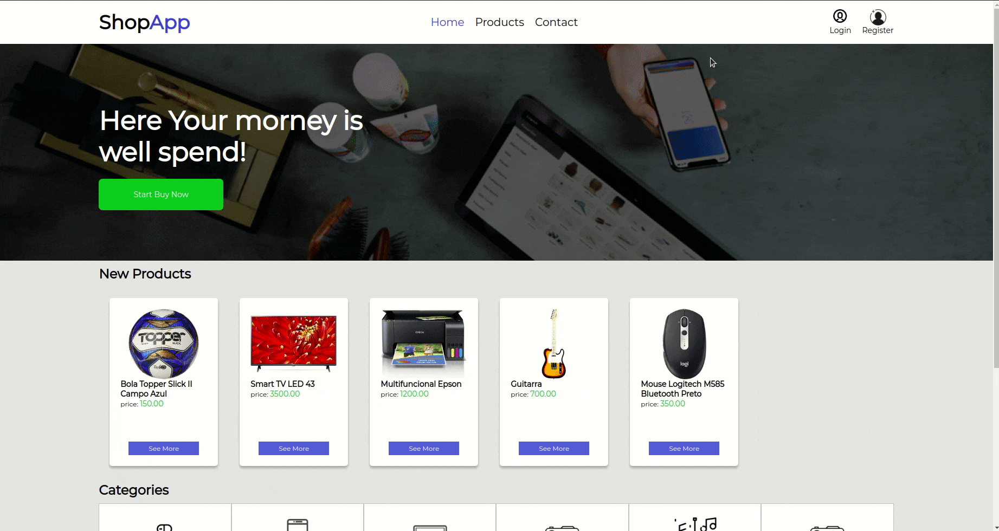

<h1 align="center">
    
    <br>
    Project Portfolio 
</h1>
<h4 align="center">
  A FullStack Project that allows the users simulate an E-commerce system, using ReactJS, NodeJS and Mysql or Postgre.
</h4>


<p align="center">
  <a href="#computer-features">Features</a>&nbsp;&nbsp;&nbsp;|&nbsp;&nbsp;&nbsp;
  <a href="#rocket-technologies">Technologies</a>&nbsp;&nbsp;&nbsp;|&nbsp;&nbsp;&nbsp;
  <a href="#information_source-how-to-use">How To Use</a>&nbsp;&nbsp;&nbsp;|&nbsp;&nbsp;&nbsp;
  <a href="#memo-license">License</a>
</p>

<p align="center">
    
</p>

<br>
<p align="center">
  <a href="https://shopapp2020-75c0b.web.app/" target = "_blank" rel="nofollow">
    
  </a>
    <a href="https://shopapp2020.herokuapp.com/"  target = "_blank" rel="nofollow">
    
  </a>
</p>

<p align="center">
  <a href="https://www.figma.com/file/BJDo8X1kqJZTwTQ1ct5wQB/Mini-E-Commerce?node-id=40%3A2" target = "_blank" rel="nofollow">
    
  </a>
</p>

## :computer: Features

- Authentication System with JWT
- Background Jobs with Redis
- Comment System
- Email System with SendGrid
- Generate PDF invoices
- Image Upload System to **User Avatar** and **Product Images**
- Real Time Cart System
- Password Recovery
- WYSIWYG editor to create great descriptions of the products
- Feel free to test the other features on the [**Live demo**](https://shopapp2020-75c0b.web.app/).

## :rocket: Technologies

This project was developed to improve my knowledges to become a FullStack Developer and to build this Project I used this technologies:

**BackEnd**
- [NodeJS](https://nodejs.org)
- [Socket.Io](https://socket.io/)
- [BcryptJS](https://www.npmjs.com/package/bcrypt)
- [Bull](https://github.com/OptimalBits/bull)
- [Express](https://expressjs.com/)
- [Hapi/Joi](https://hapi.dev/tutorials/validation/?lang=en_US)
- [Html-pdf](https://www.npmjs.com/package/html-pdf)
- [JWT](https://jwt.io/)
- [Multer](https://www.npmjs.com/package/multer)
- [SendGrid](https://sendgrid.com/)
- [Sequelize](https://sequelize.org/)
- And another bunch of packages....


**FrontEnd**
- [ReactJS](https://reactjs.org/)
- [React Router Dom](https://reactrouter.com/)
- [Html React Parser](https://www.npmjs.com/package/html-react-parser)
- [React Quill](https://www.npmjs.com/package/react-quill)
- [React Hook Form](https://react-hook-form.com/)
- [Query String](https://www.npmjs.com/package/query-string)
- [Socket.io-client](https://socket.io/docs/client-api/)
- And another bunch of packages....

## :information_source: How To Use

To clone and run this application, you'll need [Git](https://git-scm.com), [Node.js][nodejs] + [NPM][npm] installed on your computer.
You'll also need to setup and run a **Postgres** or **MYSQL** and a **Redis** database. To Email services you're going to need create a account on [SendGrid Platform](https://sendgrid.com/) to get the Key and to register a Sender Email, after finish all steps, insert the access informations into a **.env** file, based on a .env.example file that is provided in the backend folder.
From your command line:

```bash
# Clone this repository
$ git clone https://github.com/IvanildoPereira/ShopApp.git

# Go into the repository
$ cd ShopApp

# Install dependencies for the backend
$ cd backend
$ npm install

# Run migrations to your database
$ npx sequelize db:migrate

# Run the backend server on development environment
$ npm run dev

# Install dependencies for the frontend and run the server
$ cd frontend
$ npm install
$ npm start
```

## :memo: License

This project is under the MIT license.

---

Made with ♥ by Ivanildo Pereira :wave: [Get in touch!](https://www.linkedin.com/in/ivanildopconceicao/)

[nodejs]: https://nodejs.org/
[npm]: https://www.npmjs.com/
